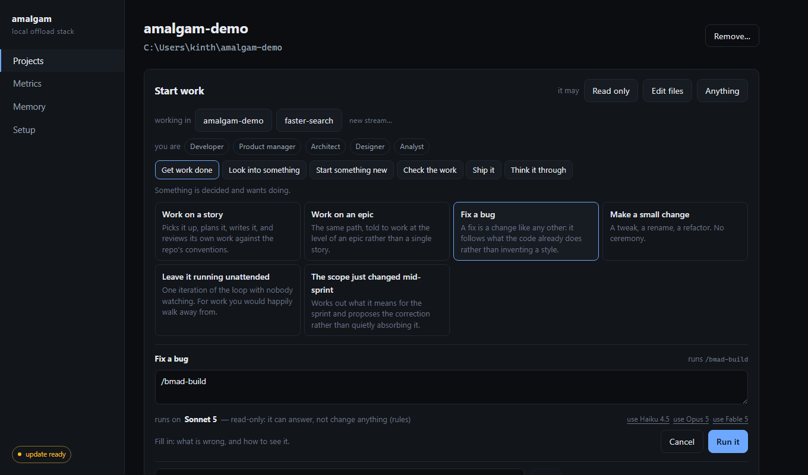
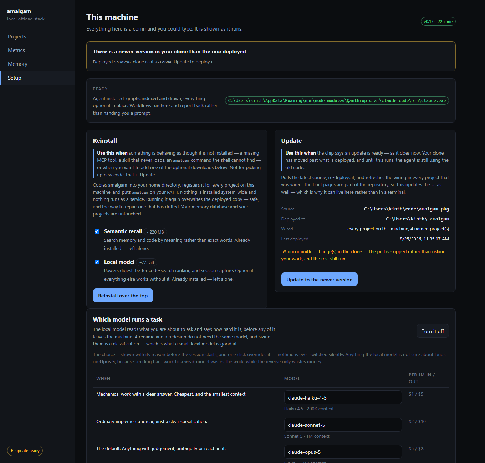

# Which model runs a task

A session runs on whatever model the agent defaults to, which means the same
model answers *"what does this function return"* and *"redesign the scheduler"*.
One of those is being overpaid for. The other may be being underserved.

The local model already on this machine can read a task and say which kind it
is. That is a classification — the thing a small model is genuinely good at —
and it happens before any of the task leaves the machine.

**Off by default.** Turn it on in Setup, or with `AMALGAM_ROUTE_MODELS=on`.

And where it is turned on and remapped:

## What it decides between

| When | Model | Context | Per 1M in / out |
|---|---|---|---|
| Mechanical work with a clear answer — a rename, a formatting fix, a factual question about the code | `claude-haiku-4-5` | 200K | $1 / $5 |
| Ordinary implementation against a clear specification — build a described feature, fix a bug with a known repro | `claude-sonnet-5` | 1M | $2 / $10 |
| **The default.** Anything with judgement, ambiguity or reach in it | `claude-opus-5` | 1M | $5 / $25 |
| Unusually hard *and* long-horizon — a large autonomous run, or reasoning where a wrong answer costs more than a slow one | `claude-fable-5` | 1M | $10 / $50 |

Prices are first-party API rates, carried so one choice can be weighed against
another. A session billed against a subscription will not see them.

Every row is editable. Point one at any model the agent accepts — a model
released next month does not need a new version of amalgam.

## Three rules, because the mistakes are not symmetrical

**It never downgrades silently.** The choice, the reason, and who made it are
on screen before the session starts, and one click overrides it. Being quietly
moved to a cheaper model is a thing done *to* somebody.

**Unsure means the default.** A classifier hedging toward the strong model
wastes money; one hedging toward the weak model wastes the work — and the work
is worth more. So anything the local model is not clear about lands on Opus,
not on Haiku. The eval scores this direction separately and holds it to a
tighter bound than the other: measured on this machine, 8 of 9 tasks land where
a careful person would put them, and **none** land below.

**Rules answer when the model cannot.** No local model, a server that will not
start, a reply that is not one of the tiers — all fall through to deterministic
keyword heuristics rather than to an error, because a session must always be
able to start. Those heuristics are deliberately timid: they only move off the
default when a task says plainly what it is, and a long task is never called
simple because one word in it was "rename".

A read-only session is a special case decided without asking anything: it can
answer questions but cannot change a file, so the tiers that exist to be careful
have nothing to be careful with.

## What it will not do

**It does not route between agents.** amalgam drives Claude Code, and sets its
`--model` flag. GitHub Copilot is a different CLI speaking a different protocol;
routing to it would be a second session runtime, not another row in this table.
GPT models are not reachable from here at all.

**It does not know your task better than you do.** The local model reads a
sentence. It has not read the codebase, does not know that this "small rename"
touches a public API, and cannot tell that you have been stuck on this for two
days. That is why the override is one click and why the reason is always shown:
the classification is an opinion offered before the work, not a verdict.

## Turning it off

Setup, or `AMALGAM_ROUTE_MODELS=off`. The environment variable wins over the
saved preference, so a machine that must always use one model can be held that
way from outside the interface. With routing off, sessions run on the agent's
own default exactly as before.
