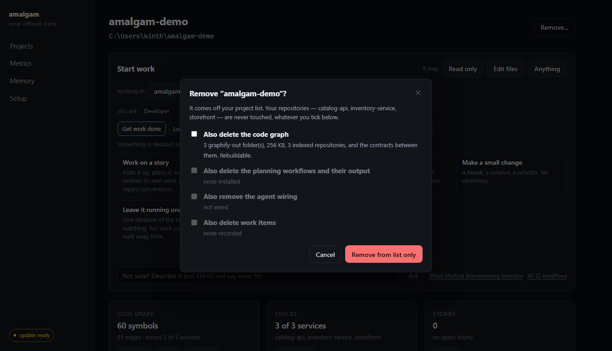
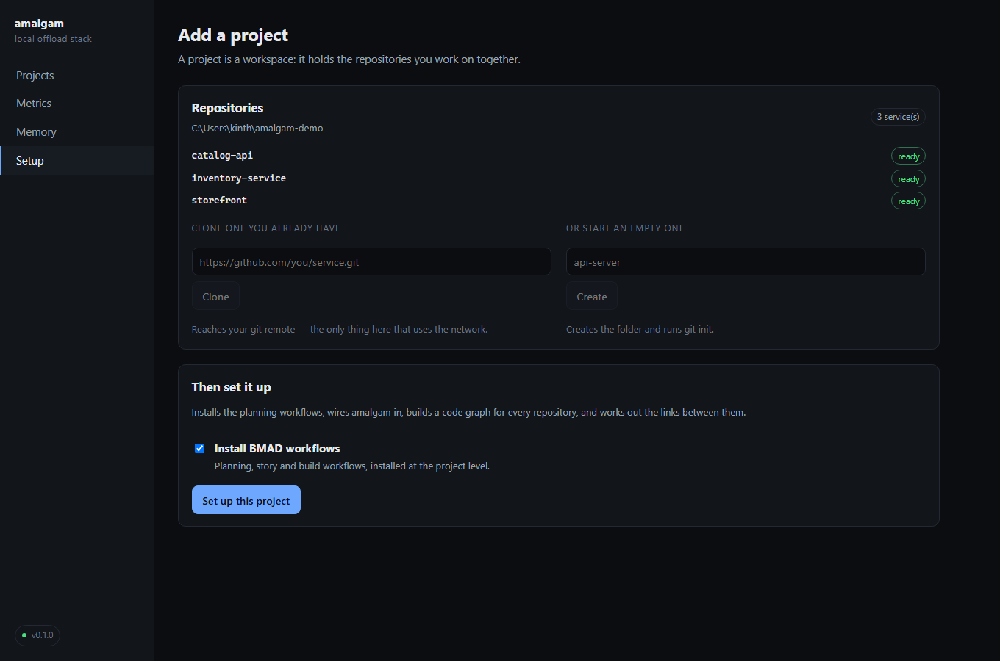
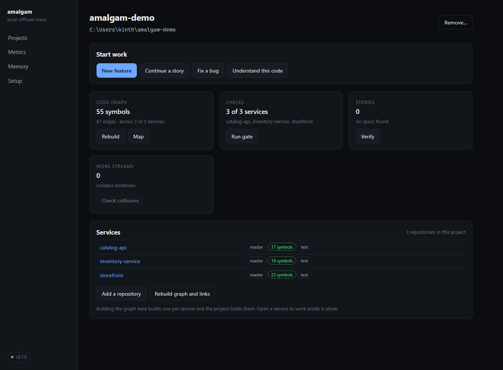
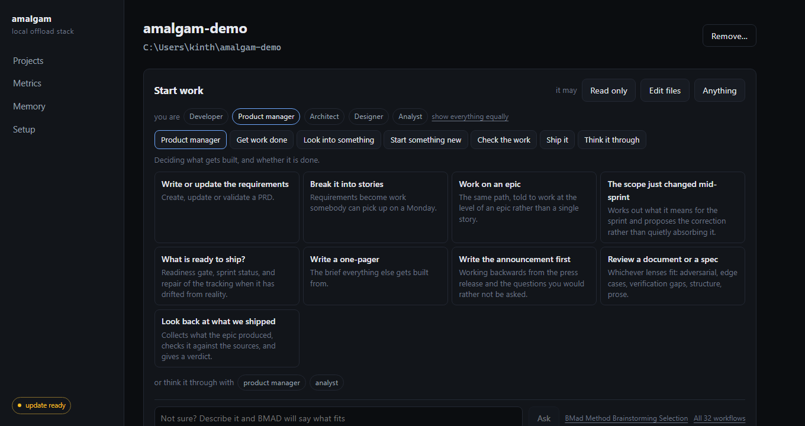
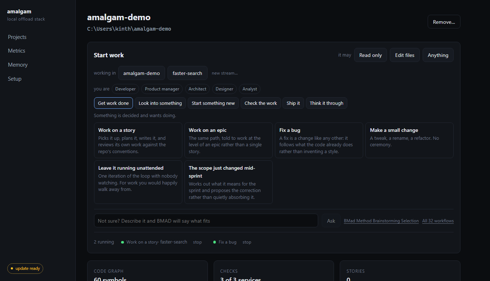
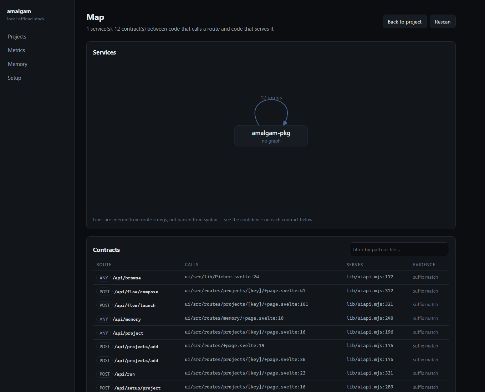
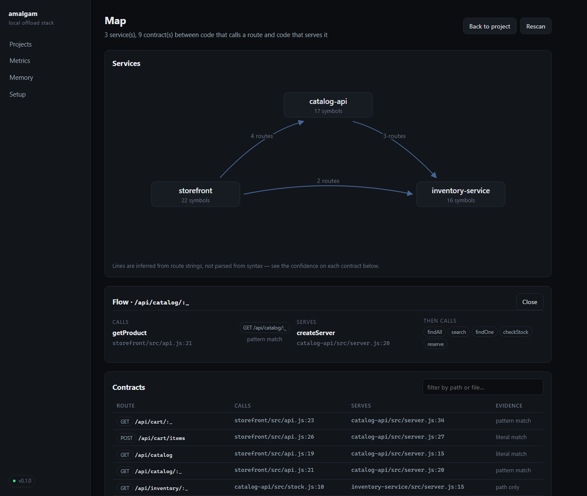
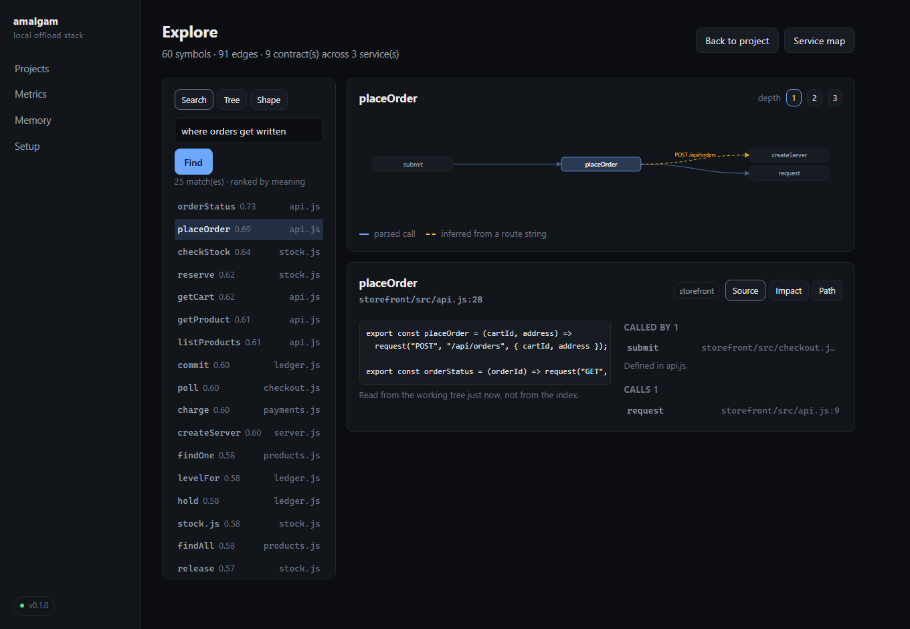
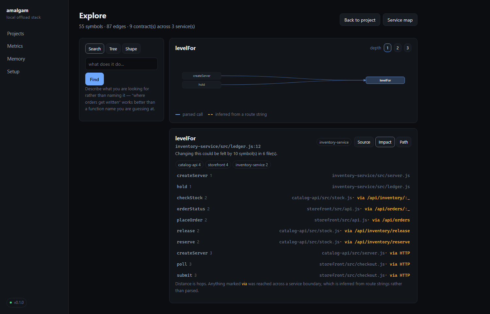

# The interface

```bash
amalgam ui
```

That is the whole installation step. The interface ships compiled inside the
repository, so a clone is all you need — no `npm install`, no build, no
toolchain. It opens a local page and serves it from Node's own http server.


It is **optional in the strong sense**: nothing else in amalgam knows it
exists, every screen does something you could type, and if you never run it
you lose nothing. Some people think in commands; this is for the rest, and for
the parts that genuinely read better as a screen — setup, dashboards, metrics.

## What it is not

- **Not a service.** It runs while you have it open and stops when you close
  it. Nothing is left listening.
- **Not networked.** It binds to `127.0.0.1` and refuses anything else. That is
  why it has no login: there is no network surface to protect rather than a
  protection step you could skip.
- **Not a second source of truth.** Every number on every screen comes from the
  same function the CLI calls. A dashboard with its own idea of "is this set
  up" would eventually disagree with the command that answers the same
  question, and you would believe whichever one is wrong.
- **Not required for anything.** Sessions, memory, graphs and checks all work
  identically whether the page is open or not.

## The screens

### Projects

The landing page: every project you have added, each showing branch, whether
the working tree is clean, whether a code graph exists, which checks were
detected, and how many work items and streams are open. A project card with
*no graph* or *no checks* is telling you something — those are the two things
everything else depends on.

Underneath, the state of this machine: Node version, whether semantic recall
and the local model are installed, whether the model is running right now and
how long before it shuts itself down, and which agent CLIs were found.

The **×** on a card removes a project. By default it removes only the list
entry: no files, no graph, no memory, no work items — it simply stops
appearing. Before anything happens you are shown what else is there, with
sizes, and can tick any of it to be deleted too — the code graph, the planning
workflows and their output, the agent wiring, the recorded work items.
**Repositories are never touched, whatever you tick.** The same control is on
the project page.



Opening a **service** from a project shows it in place rather than adding it to
the list, since a service belongs to its project and looking at something
should not change what you have chosen to track.

### Setup

The first thing on the page is what this machine is still missing — and it is
there because neither of the two buttons below it covers everything.
Reinstalling deploys amalgam and fetches the optional models; updating brings
new code. Neither signs an agent in, fetches the graph's drawing library, or
rebuilds an index that failed on an older version, because those live on the
machine rather than in the repository.

Each gap says what it is, why it matters, the command that fixes it, and —
where the fix belongs to this page — a button that runs it. A repository that
needs rebuilding links to its project, where Rebuild already is. A machine
with nothing outstanding says *Ready* and shows where the agent is.

The same check backs `amalgam update`, which prints it when it finishes, so
the terminal and the interface cannot disagree about whether you are done.

There is no page asking which kind of setup you meant — that question only has
an answer the first time. The state of the install is a chip at the bottom of
the sidebar, showing the version when everything is in place and turning amber
or red when it is not: not deployed, not wired, or a newer version sitting in
your clone waiting to be deployed. Click it to get here.

**This machine** installs amalgam, wires it for every project, and puts
`amalgam` on your PATH. The two optional downloads are checkboxes with their
sizes stated, and anything already installed says so:


Each step reports as it runs and turns green as it finishes, so a long install
never looks like a hang:


Once installed, the same button becomes **Reinstall over the top** — the way
to repair a deployed copy that has drifted. It overwrites what is deployed and
leaves your memory database and projects alone.

**Update** is beside it, and runs `amalgam update`: pull the latest source,
re-deploy it, refresh the wiring in every project that was wired. The built
pages are part of the repository, so this updates the interface as well — which
is the reason it can live here at all. It tells you first if the pull will be
skipped because there is uncommitted work in the clone, and afterwards offers
to reload, since the pages you are looking at came from the version that was
just replaced.

Everything on this page is an `amalgam` command shown as it runs. The first
time still comes from a terminal — you need a clone before there is a UI to
click — but from then on either works.

**A project** is one wizard whether or not it exists yet, because the only
difference is what the folder already contains. It starts by asking which
folder: the chooser lists real directories from your machine and marks which
are already git repositories or already have BMAD — no typing paths. A **new**
project must land on an empty folder, or a name you type to create one, since
dropping a workspace on top of an existing tree produces something nobody can
reason about later:


Then it asks what is in it. Clone a repository you already have, or start an
empty one and it runs `git init` for you — as many as the project needs:



**Set up this project** does the rest in one go: installs the planning
workflows, wires amalgam in, builds a code graph for every repository, and
works out the links between them. That is the whole definition of ready, so
there is nothing left to run by hand afterwards.

A step that fails stops the sequence, because the steps after it assume it
worked, and its last lines of output are shown in place so you can see why
without going to look for a log:


#### Keeping graphs current

The one thing amalgam does without being asked, so it is the one thing that
should not be invisible. When a session ends, a graph that has fallen behind
its code is rebuilt: the machine is idle, nobody is waiting, and the session
that benefits is the next one. Only the index is rebuilt — drawing and
clustering are what make a rebuild slow, and neither changes what an agent can
find.

The card names every repository, what its last build actually cost, and what
would happen to it when a session ends. Three rules keep it from eating the
machine:

- **A budget.** More than 90 seconds and it is not something to start behind
  somebody's back.
- **A cooldown.** Three sessions in an hour must not mean three rebuilds of
  the same repository.
- **A measurement first.** A repository amalgam has never timed here is never
  started on a guess. Size predicts build cost badly — what costs time is how
  much of a tree the extractor refuses to cache — so it waits for one
  deliberate build to learn from, and says so rather than quietly skipping.

**Turn it off** and the machine does nothing unbidden; the graph then goes
stale, which costs precision and never correctness, and the interface keeps
saying how far behind it is. `AMALGAM_AUTO_REFRESH` still wins where it is
set, so a machine that must never start work on its own can be held that way
from outside the interface.

### A project


Everything about one codebase on one page.

- **Start work** — the tasks somebody actually sits down to do, described
  below.
- **Code graph** — symbols, edges, when it was last indexed, and buttons to
  rebuild, open the service map, explore the symbols, or open the **Diagram**.
  Rebuild does the whole job: extract, cluster, name the communities with the
  local model if one is installed, and work out the links between services.
  There is no flag to remember and nothing left to run in a terminal.
- **Diagram** — graphify's own interactive graph, served rather than rebuilt.
  Every symbol a node, coloured by the community it belongs to, with a sidebar
  to filter and search and a panel that inspects one.

  The button is there as soon as a graph exists, whether or not a picture has
  been drawn yet, and opens a panel naming every repository and whether it is
  drawn. **Draw it** runs the clustering pass alone — the symbols and edges
  already exist, so it is seconds rather than the minutes a rebuild costs.

  Size is not a reason to skip it. graphify draws the graph at the scale of
  its communities rather than its symbols, so a 95,826-symbol repository is a
  2.8 MB page that opens in about a second. It takes a minute or two to build
  and the panel says so, but a large graph is exactly the one worth having:
  you land on the whole thing and filter down with the sidebar, and there is
  nothing to filter if it was never drawn.

  The page fetches its drawing library from a CDN, so the first time it would
  need the internet the panel offers to keep a 686 KB copy locally; after that
  it never reaches the network again.
- **Checks** — what was detected, and a button to run the gate.
- **Stories** — how many exist and, in the number worth watching, how many are
  marked done while declaring no way to check them.
- **Work streams** — how many are in flight, and a collision check when there
  is more than one.
- **Riskiest files** — churn × dependents, with the reasons attached, and the
  files that keep changing together despite living apart.
- **Work items** — the threads tying stories to branches to decisions.

Anything that takes time runs as a job with the same live progress as the
setup wizard.

**A project is a workspace; the repositories inside it are services.** That is
the shape BMAD assumes — it installs at the project level and its documents
describe the system across services — and the interface follows it. A project's
graph is the union of its services' graphs, its checks are the checks its
services declare, and a Services panel shows each one with its own state:



The Services panel is also where a project grows. **Add a repository** clones
one you already have or creates an empty one and runs `git init` in it, and
**Rebuild graph and links** re-runs the graph and the contract scan across
every service — which happens automatically after an add, because a repository
nothing has indexed is not yet part of the project. An empty workspace shows
the same panel, since a project with nothing in it is exactly the one that
needs it.

Building the graph from the project builds one per service, correctly: mixing
several codebases into a single index produces something too muddled to answer
anything. The project then totals them, and `code_context` asked at the project
level searches across all of them. Open a service to work inside it alone.

If a card cannot do its job it says why rather than sitting at "none" —
`uv` missing, a service whose graph was built before the index existed, or a
folder that has no repositories in it yet.

### Start work

Tasks, not command names. *Work on a story*, *Fix a bug*, *Investigate an
issue*, *What is ready to ship?* — the things somebody knows they are doing
when they sit down. Which workflow serves one is the framework's business:
several of these run the same command, because the difference between fixing
a bug and picking up a story is what you tell it, not which machinery runs.

Grouped by the hats a small team wears — get work done, look into something,
start something new, check the work, ship it, think it through — because on a
team of one all of those are the same afternoon.

**And by who is sitting down.** A hat is what you are doing this hour; a role
is what you are doing this job. Say which one you are and the menu reorders:
your work arrives as the first tab, and the specialists you would actually
talk to are named under it.



It orders; it does not restrict. Every hat is still there, one click away,
and **show everything equally** puts it back — because the person who most
needs a task outside their role is the one who has just been handed it. The
choice is remembered per person rather than per project, since it does not
change when you switch codebases, and `?you=Architect` on a project link
opens somebody else's view of the same page.

BMAD ships five agents with names and characters — Mary the analyst, John the
product manager, Winston the architect, Sally the designer, Amelia the
developer — and they are a different kind of thing from a workflow: you talk
to them rather than run them. So they sit beside the tasks rather than in the
list, and each role surfaces the two it works with most.

Picking a task **prefills**; it does not send. What runs is a line you can
read and edit before pressing Run, so the interface and a terminal do the same
thing and you can always see which. The card says what each one runs for
anyone who wants to know.

What the agent is allowed to do is chosen up top — read only, edit files, or
anything — in the words of what it permits rather than as a mode name.

A few tasks run against amalgam's own tools rather than a workflow, because
"what would break if I changed this" is a graph question and routing it
through a planning workflow would be a worse answer. Those say so.

Anything whose workflow is not installed is not offered, so a BMAD upgrade
that renames or removes one leaves no dead button behind.


**Nothing runs until you press Run it.** A button that hides what it is about
to ask an agent to do is a button nobody can review, so the composed text is on
screen, editable, and the card names the workflow underneath it.

Which task is picked lives in the URL — `?task=fix-a-bug` on a project link
opens the page with that one already composed — so a prompt can be sent to
somebody rather than described to them.

What makes it worth pressing is what is already in it. The prompt arrives
carrying the project path, whether a code graph exists, the project's real
check command, your open work items, the stories that are not finished, and
the facts memory already holds — so the session does not spend its first
several exchanges rediscovering them.

If no agent CLI is on PATH there is still the same composed text to copy into
whatever session you already use. That is exactly how BMAD works today, and it
is never worse than what you have now.

### Sessions, and more than one of them

The agent runs in amalgam, not in the page. Navigating away has never stopped
one — the transcript is replayed in full the moment a page reconnects — but
the only way back used to be a URL you happened to keep, which left a live
session spending tokens with nothing able to reach it.

So every session a project has is listed under **Start work**, running or
finished, with where it is working and a way to stop it:



Click one to watch it; **Close** puts it away without stopping it. Starting
another while one runs is ordinary — nothing is serialised — and each keeps
its own context, permissions and half-finished work between messages, because
the child process stays alive rather than being restarted per turn.

Sessions live for as long as amalgam is running. Stopping the interface ends
them, which is the one thing worth knowing before closing a terminal.

### Working somewhere else

**working in** chooses where the next session runs: the project itself, or a
**work stream** — a git worktree of one repository, on its own branch, checked
out beside it.

That is the answer to running two agents at once on the same code. Two
sessions editing one working tree is not parallelism, it is a merge conflict
being written twice; two worktrees are genuinely independent, and **Check
collisions** compares them before anything merges.

**new stream…** makes one: pick the repository, name it, and the branch
`stream/<name>` and its folder appear beside the repo. Nothing is ever removed
without being asked — see [the tools reference](tools.md#parallel-work) for how
they are reclaimed. Streams created here and streams created with `amalgam stream new`
are the same thing, made by the same code.

A worktree is not a service, even though it sits next to one and looks like a
checkout. It is excluded from a project's services deliberately: counted as one
it would contribute its parent's symbols a second time and run its checks
again.

### Asking which workflow fits

BMAD already answers "what should I run for this?" — that is what
`/bmad-help` is for, and reimplementing it as a menu would be a worse copy of
something already installed. So the project page asks it: a box under **Start
work**, a question in your own words, and the answer arrives in a session you
can keep talking to.

Beside it, quietly: any workflow that ships its own chooser page, and the full
list of what is installed. Both are read from the project's skills each time,
so a BMAD upgrade that adds a workflow appears without amalgam being taught
about it, and deprecated forwarding stubs are left out.

A chooser — BMAD's brainstorming selector is the one that ships today — opens
embedded rather than in a separate window. It was written to put a prompt on
your clipboard for pasting back into a chat; the copy served here also hands
the prompt straight to a session, so the step where you carry text between two
windows the interface is already showing you does not need to happen. The file
on disk is untouched and the clipboard still gets the text.

### Map

A code graph only knows connections written as symbols. When one component
talks to another through a **string** — an HTTP route, a queue topic — the
parser sees a call to `fetch` and nothing more. This repository demonstrates it
against itself: the client calls `/api/state`, the server defines it, and the
graph holds zero edges between them.

The map infers those edges from evidence and draws the result:



- **Services** — one box per repository, with the contracts between them as
  arrows. A single-repository project shows one box and a loop, which is the
  honest picture of a frontend calling its own backend.

  Click a service and the map re-centres on it: what calls it on the left, the
  service in the middle, what it calls on the right. The geometry carries the
  direction, so nothing has to be read off an arrowhead. Services outside the
  project appear too, dashed, named from how the calling code addresses them —
  `${PAYMENTS_URL}` becomes **payments**, which is the only identity a
  configured host leaves in the source. They are not clickable, because there
  is nothing here to open. Each service view carries a **Diagram** link to that
  repository's own interactive graph, and the focused service is in the URL
  (`?service=catalog-api`) like everything else worth sending to somebody.
- **Contracts** — every route paired with the code that calls it, each with the
  evidence behind it: a literal path meeting a literal route is strong, a
  wrapper call matched by suffix is weaker, and both say so.
- **Routes nothing calls** and **calls to nothing here** — dead endpoints, or
  calls to a service outside this project.

Click a contract to trace the flow end to end:



Caller, the route it crosses, the handler that serves it, and what that handler
goes on to call — which is the thing you actually want before changing an
endpoint. Flows are deep-linkable (`?flow=/api/state`), so one can be sent to
somebody rather than described.

Refresh it with **Rescan**, or `amalgam contracts` from a terminal. These edges
are inferred, never mixed into the parsed `calls` edges, and re-verified against
the source before being shown — a match whose literal has since moved is
dropped rather than reported.

### Explore

The map is about services. This is about symbols — the same questions
graphify's own viewer answers, asked of a whole project at once, over the
graph the agent uses, with the service boundaries joined up.



Three panes, because three questions get asked together and splitting them
across pages means losing your place every time you follow an edge.

**Find**, on the left, three ways:

- **Search** — describe what you want rather than naming it. *"where orders
  get written"* beats a function name you are guessing at. Ranked by meaning
  when the embedding model is installed, by name when it is not, and it says
  which you are getting.
- **Tree** — service, then directory, then file, then symbol, with a count on
  every row so a folded branch still says how much it is hiding. The view that
  answers "what is even in here", which no node-and-edge picture ever does.
- **Shape** — the hubs (most connected: where a change is felt widest), the
  clusters and how tightly each hangs together, and the edges that bridge
  otherwise separate clusters.

**Draw**, in the middle: the neighbourhood of the selected symbol as columns,
not a cloud. Callers to the left, the symbol in the middle, callees to the
right — direction in the geometry rather than in an arrowhead you have to
squint at, and the same layout every time so it can be talked about. Depth 1–3.
Click any box to move there.

Edges inferred from route strings are **dashed and labelled with the route**,
because an HTTP hop is not a function call and drawing it identically would be
a lie the picture tells silently.

**Read**, below: the source, taken from the working tree the moment you asked —
never quoted from the index. If the symbol has moved since the graph was built
it is found anyway and the page says where it actually is; if it is gone, the
page says gone rather than showing you something stale. Beside it, what calls
this and what this calls, each clickable, with a count of any index edges that
were not in the source and so are not listed.

Two more tabs on that pane:

- **Impact** — what a change here could reach. Reverse traversal across the
  whole project, counted per service, ordered by hops. Anything reached through
  a route string is marked *via* with the route it travelled, because a blast
  radius that stops at a repository boundary is wrong in the expensive
  direction, and one that crosses it silently is wrong in the other:

  

- **Path** — how one symbol reaches another. Directed first, since "does A
  eventually call B" is the question people mean; if there is no directed
  route, the undirected one is returned and labelled as such. Each hop over the
  wire is shown as the route it crosses.

Everything on this page is arithmetic over files already on disk. No model is
involved and nothing is started. The whole view is deep-linkable — `?id=` for
the symbol, `?panel=impact` for the tab — so a finding can be sent to somebody
rather than described.

### Metrics


Measured savings per tool, what was avoided in total, and recent daily volume.
It keeps the same discipline as `amalgam stats`: a saving is only counted where
a real counterfactual exists — a packet knows the files it replaced, a digest
knows what it consumed. Recall is shown as *not measurable*, because measuring
it would mean running the alternative.

### Memory


What survives between sessions, filterable, with stale facts marked. If a
finished session proposed anything, it is at the top waiting for review —
nothing was written automatically.

## Working on the interface itself

Only relevant if you are changing it. The source is SvelteKit (Svelte 5 runes)
in `ui/`, built to static files with `adapter-static`:

```bash
cd ui && npm install && npm run build     # or: npm run ui:build from the root
```

`npm run dev` inside `ui/` gives hot reload and proxies `/api` to a running
`amalgam ui`, so development talks to the same API the shipped build does and
the two cannot drift.

**Commit `ui/build` when you change the interface.** That directory is what
users actually run, and a source change without a rebuild ships the old page.

---

Prefer the terminal? The [tool map](tools.md) is the same capabilities as
commands, and nothing in this file is required.
