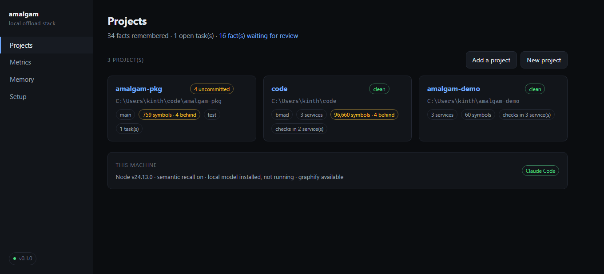
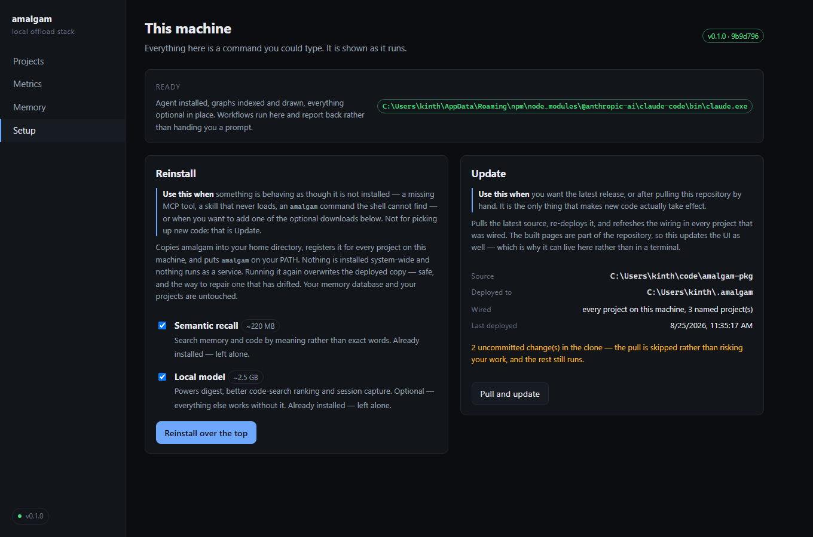
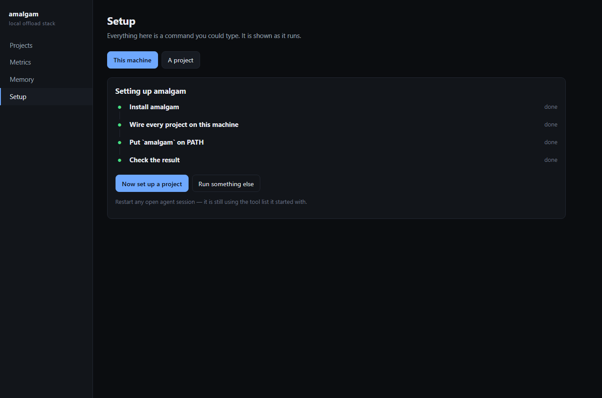
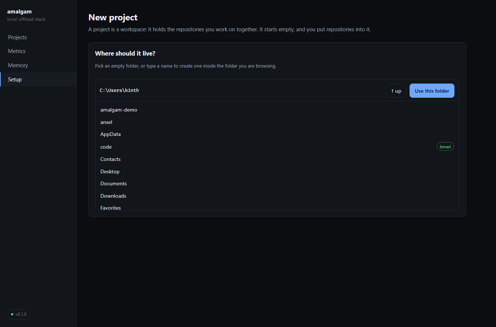
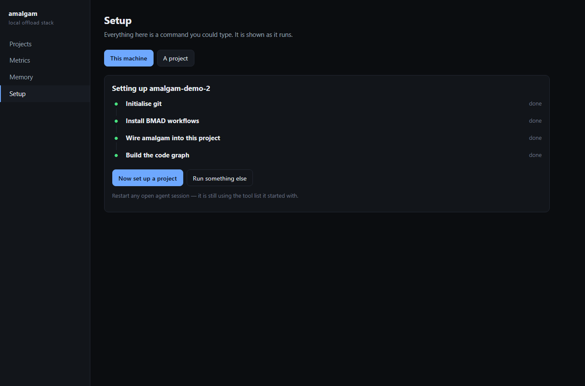
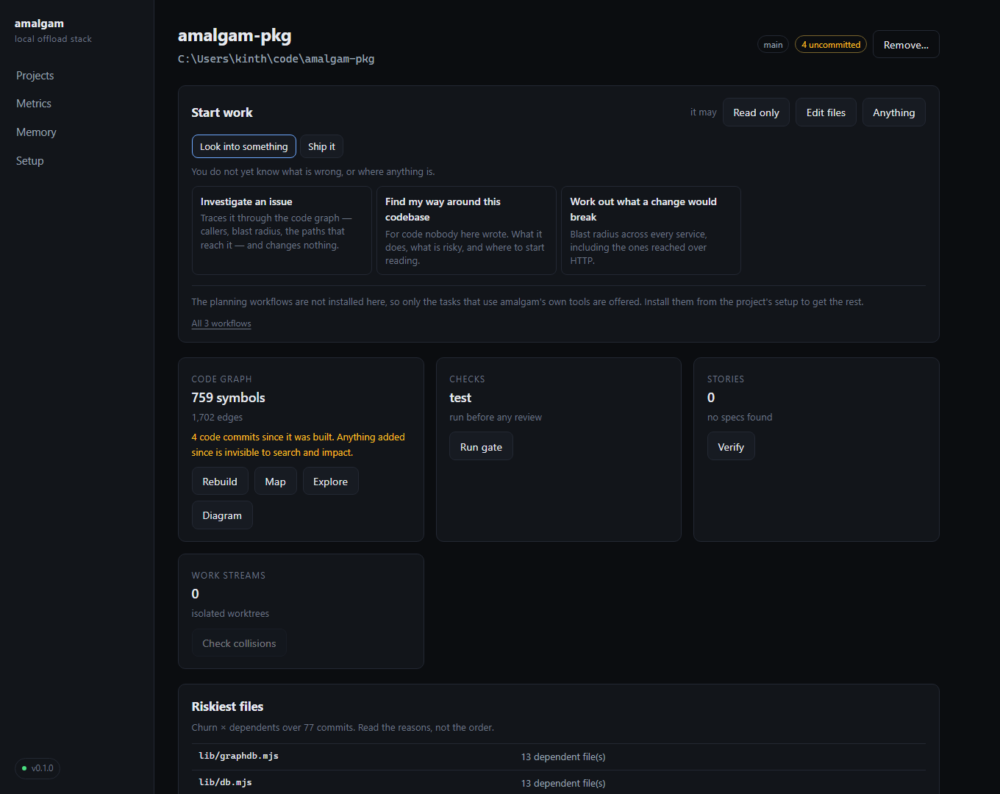
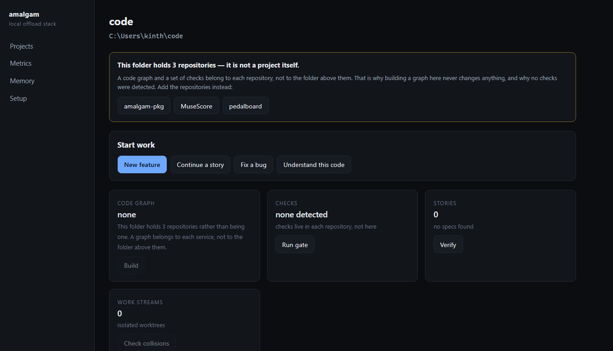
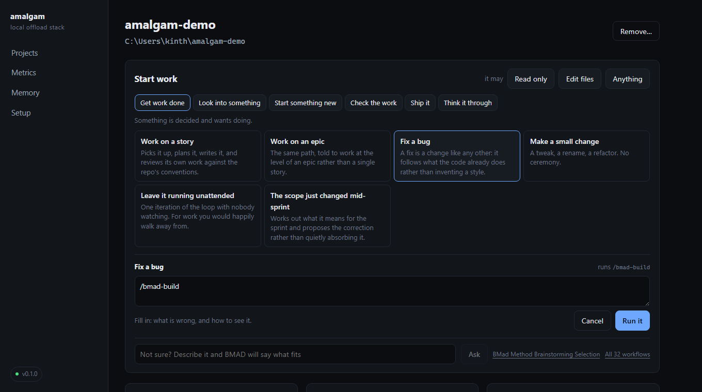
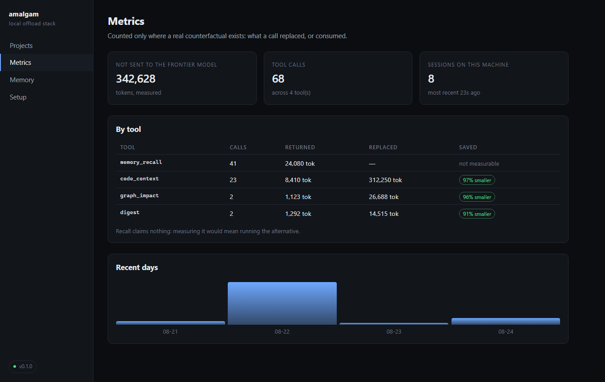
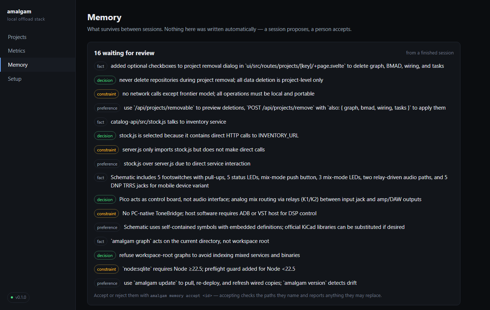

# The interface

```bash
amalgam ui
```

That is the whole installation step. The interface ships compiled inside the
repository, so a clone is all you need — no `npm install`, no build, no
toolchain. It opens a local page and serves it from Node's own http server.



It is **optional in the strong sense**: nothing else in amalgam knows it
exists, every screen does something you could type, and if you never run it
you lose nothing. Some people think in commands; this is for the rest, and for
the parts that genuinely read better as a screen — setup, dashboards, metrics.

## What it is not

- **Not a service.** It runs while you have it open and stops when you close
  it. Nothing is left listening.
- **Not networked.** It binds to `127.0.0.1` and refuses anything else. That is
  why it has no login: there is no network surface to protect rather than a
  protection step you could skip.
- **Not a second source of truth.** Every number on every screen comes from the
  same function the CLI calls. A dashboard with its own idea of "is this set
  up" would eventually disagree with the command that answers the same
  question, and you would believe whichever one is wrong.
- **Not required for anything.** Sessions, memory, graphs and checks all work
  identically whether the page is open or not.

## The screens

### Projects

The landing page: every project you have added, each showing branch, whether
the working tree is clean, whether a code graph exists, which checks were
detected, and how many work items and streams are open. A project card with
*no graph* or *no checks* is telling you something — those are the two things
everything else depends on.

Underneath, the state of this machine: Node version, whether semantic recall
and the local model are installed, whether the model is running right now and
how long before it shuts itself down, and which agent CLIs were found.

### Setup

Two wizards, both showing their work.

**This machine** installs amalgam, wires it for every project, and puts
`amalgam` on your PATH. The two optional downloads are checkboxes with their
sizes stated, and anything already installed says so:



Each step reports as it runs and turns green as it finishes, so a long install
never looks like a hang:



**A project** starts by asking which folder. The chooser lists real directories
from your machine and marks which are already git repositories or already have
BMAD — no typing paths:



Then it initialises git if needed, installs the BMAD workflows, wires amalgam
in, and builds the code graph:



A step that fails stops the sequence, because the steps after it assume it
worked, and its last lines of output are shown in place so you can see why
without going to look for a log.

### A project



Everything about one codebase on one page.

- **Start work** — four buttons, described below.
- **Code graph** — symbols, edges, when it was last indexed, and a button to
  rebuild.
- **Checks** — what was detected, and a button to run the gate.
- **Stories** — how many exist and, in the number worth watching, how many are
  marked done while declaring no way to check them.
- **Work streams** — how many are in flight, and a collision check when there
  is more than one.
- **Riskiest files** — churn × dependents, with the reasons attached, and the
  files that keep changing together despite living apart.
- **Work items** — the threads tying stories to branches to decisions.

Anything that takes time runs as a job with the same live progress as the
setup wizard.

If a card cannot do its job it says why rather than sitting at "none". The
common one is adding a folder that holds repositories instead of a repository:
a graph and a set of checks belong to each repo, so building at the level above
them never changes anything. The interface detects that and offers the
repositories by name.



### Start work

Four buttons for the four shapes of work people actually begin:

| Button | What it sets up |
|---|---|
| **New feature** | The full path: frame the problem, agree the shape, cut it into stories that each declare a check, build the first |
| **Continue a story** | Pick up something already specified and implement it |
| **Fix a bug** | Reproduce first, understand the blast radius, change as little as possible |
| **Understand this code** | Survey an unfamiliar codebase before touching it |



**Every button shows you the prompt before anything runs.** A button that hides
what it is about to ask an agent to do is a button nobody can review, so the
composed text is on screen, copyable, and yours to edit.

Each flow is deep-linkable — `?flow=feature` on a project URL composes it
immediately, so a prompt can be bookmarked or sent to somebody rather than
described to them.

What makes it worth pressing is what is already in it. The prompt arrives
carrying the project path, whether a code graph exists, the project's real
check command, your open work items, the stories that are not finished, and
the facts memory already holds — so the session does not spend its first
several exchanges rediscovering them.

Then, depending on what your machine has:

1. **An agent CLI is on PATH** — it can open a session with the prompt in
   place.
2. **No CLI** — copy the prompt into whatever session you already use.

Both are fine. The second is exactly how BMAD works today, and it is never
worse than what you have now.

### Metrics



Measured savings per tool, what was avoided in total, and recent daily volume.
It keeps the same discipline as `amalgam stats`: a saving is only counted where
a real counterfactual exists — a packet knows the files it replaced, a digest
knows what it consumed. Recall is shown as *not measurable*, because measuring
it would mean running the alternative.

### Memory



What survives between sessions, filterable, with stale facts marked. If a
finished session proposed anything, it is at the top waiting for review —
nothing was written automatically.

## Working on the interface itself

Only relevant if you are changing it. The source is SvelteKit (Svelte 5 runes)
in `ui/`, built to static files with `adapter-static`:

```bash
cd ui && npm install && npm run build     # or: npm run ui:build from the root
```

`npm run dev` inside `ui/` gives hot reload and proxies `/api` to a running
`amalgam ui`, so development talks to the same API the shipped build does and
the two cannot drift.

**Commit `ui/build` when you change the interface.** That directory is what
users actually run, and a source change without a rebuild ships the old page.

---

Prefer the terminal? The [tool map](tools.md) is the same capabilities as
commands, and nothing in this file is required.
